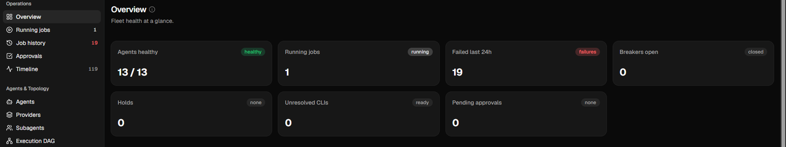
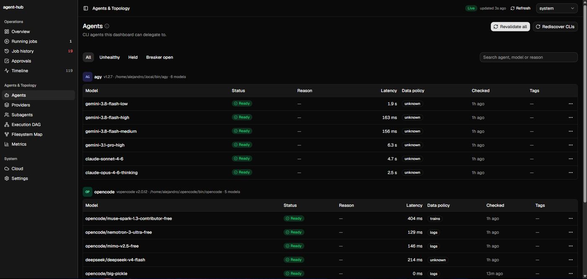
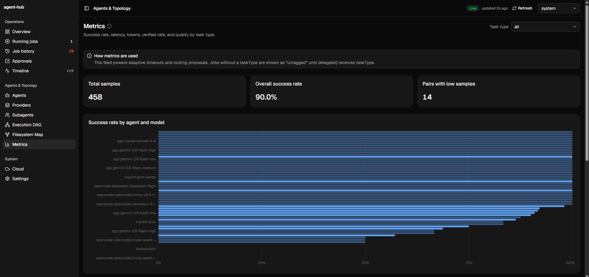
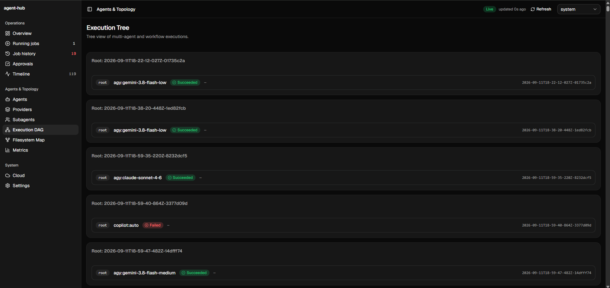
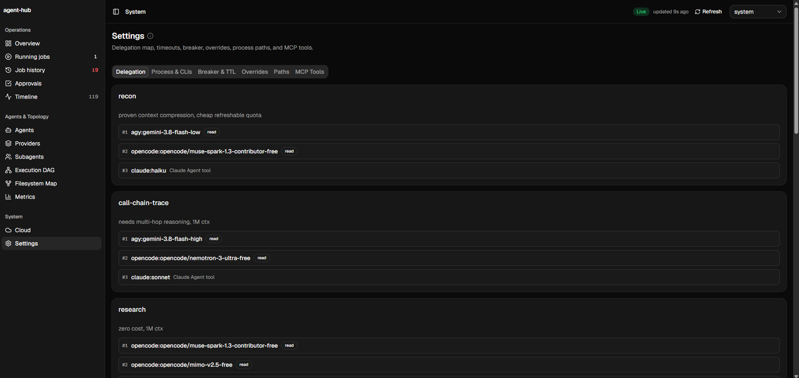

# agent-hub

> Local MCP orchestration layer for delegating bounded coding tasks across
> multiple AI coding agents.


Delegate specialized work from Claude Code, OpenCode, or any MCP client to the
coding agents you already have installed — without hand-managing processes,
fallbacks, retries, quotas, or execution state.

```
Claude Code / OpenCode / any MCP client
                  │
                  ▼
             agent-hub
                  │
      ┌───────────┼───────────┐
      ▼           ▼           ▼
     agy       OpenCode     Copilot        (…and Codex, Jules)
      │           │           │
      └───────────┼───────────┘
                  ▼
      execution · routing · recovery · workflows
                  │
                  ▼
              Dashboard
```

## What is agent-hub?

agent-hub is a **local MCP server and execution layer** for delegating bounded
tasks to multiple coding agents. It handles agent discovery, capability-aware
routing, execution, retries, recovery, workflows, verification and monitoring —
so the orchestrator states *what* it wants done, not *which CLI to drive*.

### Why?

Without agent-hub, the orchestrator owns every detail:

```
Claude Code
   ├── manually call agy
   ├── manually call OpenCode
   ├── manually retry failures
   ├── manually inspect results
   └── manually track state
```

With agent-hub, those become the layer's job:

```
Claude Code
      │
      ▼
 agent-hub
   ├── discover     which agents are installed and healthy
   ├── route        pick an agent+model for the task
   ├── execute      run it, stream and persist the result
   ├── retry        fall back on failure, quota or breaker
   ├── verify       artifacts, deterministic checks, judge
   ├── orchestrate  multi-step DAGs with dependencies
   └── monitor      event log, metrics, dashboard
```

## Key features

- **Multi-agent delegation** — agy (Antigravity), OpenCode, GitHub Copilot CLI,
  Codex CLI locally, and Google Jules in the cloud.
- **Capability-aware routing** — filters candidates by hard requirements and
  ranks them by quality, cost and latency preferences.
- **Reliable execution** — retries, automatic fallback chains, per-class circuit
  breakers, and timeouts that adapt to how long each agent and model actually takes.
- **Workflow orchestration** — DAGs with `dependsOn` and parallel waves; a step
  can run over a list and combine the results. Runs survive a crash and resume
  where they stopped.
- **Evidence & verification** — artifacts, deterministic verification commands
  and a judge/revision loop that can send work back for another pass.
- **Safe write execution** — worktree isolation, single-writer coordination, and
  a read-mode guard that fails a job which touched the disk.
- **State you can trust** — runs persist across restarts, a dispatch is
  idempotent across processes, and a slow agent is never mistaken for a dead one.
- **Observability** — event log, metrics, subagent tracking and a local
  dashboard.
- **Harness integration** — Claude Code, OpenCode and custom MCP clients get the
  waiting behaviour they expect, and a finished delegation can resume the session
  that asked for it.

## Architecture at a glance

```
                    ┌────────────────────┐
                    │   Claude Code      │
                    │   OpenCode         │
                    │   External agents  │
                    └─────────┬──────────┘
                              │ MCP
                              ▼
                    ┌────────────────────┐
                    │     agent-hub      │
                    ├────────────────────┤
                    │ Planner            │
                    │ Router             │
                    │ Dispatcher         │
                    │ Policy engine      │
                    │ Workflow engine    │
                    │ Verification       │
                    │ Storage            │
                    └─────────┬──────────┘
                              │
          ┌───────────────────┼──────────────────┐
          ▼                   ▼                  ▼
      Local CLIs           Cloud              State
      agy                  Jules              SQLite
      OpenCode                                Events
      Copilot                                 Artifacts
      Codex
```

→ **[Architecture](docs/architecture.md)** ·
**[Execution model](docs/execution.md)** ·
**[Storage](docs/storage.md)**

## Supported agents

| Agent | Local / Cloud | Typical use |
|---|---|---|
| Antigravity (`agy`) | Local | Delegated coding tasks, large-context recon |
| OpenCode | Local | Coding and research, free-tier models |
| GitHub Copilot CLI | Local | GitHub-aware tasks |
| Codex CLI | Local | Bounded fallback tasks |
| Google Jules | Cloud | Long-running remote tasks that end in a pull request |

Per-agent notes: **[agy](docs/providers/agy.md)** ·
**[OpenCode](docs/providers/opencode.md)** ·
**[Copilot](docs/providers/copilot.md)** ·
**[Jules](docs/providers/jules.md)**

## Quick start

**Requirements:** Node.js ≥ 20.19 and at least one supported agent CLI installed
and authenticated.

```bash
git clone https://github.com/jalejandrov93/agent-hub.git ~/agent-hub
cd ~/agent-hub

npm install
node bin/agent-hub selftest
```

**Connect Claude Code.** Use an absolute `node` path: a version-manager shim only
exists inside the shell that created it.

```bash
claude mcp add --scope user agent-hub -- \
  /path/to/node /path/to/agent-hub/bin/agent-hub mcp
```

**Connect another MCP client** by pointing it at
`/path/to/node /path/to/agent-hub/bin/agent-hub mcp` over stdio. The server is
harness-agnostic: Claude Code, OpenCode and custom clients call the same 28
tools, and each caller gets the waiting behaviour its harness profile declares.

**Install only the runtime**, keeping the checkout wherever you develop:

```bash
npm run install:local -- --restart
```

`install:local` builds the dashboard, copies the runtime into
`~/.claude/mcp-servers/agent-hub`, installs production dependencies there and
records the exact commit. Re-run it after every `git pull`.

→ Full instructions, hooks, the dashboard service and skill install:
**[Getting started](docs/getting-started.md)**

### First delegation

Ask your orchestrator for the outcome, not the mechanism:

> "Use agent-hub to investigate why the authentication flow is failing and
> return a concise diagnosis."

Under the hood that is one `dispatch` call:

```json
{
  "taskType": "call-chain-trace",
  "task": "Trace how the authentication flow works and return a concise diagnosis.",
  "cwd": "/path/to/repo",
  "mode": "read",
  "timeoutS": 180
}
```

```
User ── "Trace the authentication flow..."
  ▼
Claude Code / OpenCode / any MCP client ── dispatch(taskType="call-chain-trace")
  ▼
agent-hub
  ├── route()    → primary: agy + gemini-high   fallback: OpenCode
  ├── execute    → policy, retries, fallback chain
  ├── verify     → artifacts, deterministic checks, judge
  └── result     → stdout, artifacts, status, tokens
  ▼
Claude Code ── the job record and its result
```

Useful tools to know: `route` (who can do this), `dispatch` (run it with policy
and idempotency — the default choice), `delegate` (raw escape hatch: one exact
agent+model, no policy), `job_wait`, `job_result`, and
`plan_task`/`execute_plan` for multi-step work. The complete surface is in
**[MCP tools](docs/reference/tools.md)**.

## Common use cases

| Use case | Ask for |
|---|---|
| **Codebase reconnaissance** | "Trace how authentication flows through the repository." |
| **Second opinion** | "Review this implementation and identify architectural risks." |
| **Large artifact analysis** | "Analyze these logs and identify recurring failures." |
| **Mechanical work** | "Update these 40 files according to the migration pattern." |
| **Multi-step workflow** | Research → Implementation → Verification → Review |

## Workflows

Workflows are DAGs: steps declare `dependsOn`, independent steps run in parallel
waves, and a step can run over a list and combine the results. Runs are persisted,
so a crash resumes where it stopped and a succeeded step is never re-executed.

```
      Research
      ├─────────────┐
      ▼             ▼
   Analysis       Security
      │             │
      └──────┬──────┘
             ▼
        Implementation
             │
             ▼
          Verify
             │
             ▼
          Review
```

→ **[Workflows](docs/workflows.md)** ·
**[Verification](docs/verification.md)** ·
**[execution contract](docs/execution-contract.md)**

## Dashboard

A local dashboard ships with the runtime:

```bash
node bin/agent-hub dashboard
# http://127.0.0.1:7777
```



| Agents and data policy | Metrics |
|---|---|
|  |  |

| Execution tree | Delegation map |
|---|---|
|  |  |

It shows agent availability, running jobs, execution history, metrics,
subagents, the timeline, routing proposals, learnings and configuration.

→ **[Observability and dashboard](docs/dashboard.md)**

## Configuration

| Variable | Effect |
|---|---|
| `AGENT_HUB_HOME` | State directory (default `~/.local/share/agent-hub`). |
| `AGENT_HUB_STORE` | Job read path: `json` (default), `sqlite`, or `shadow` (read JSON, verify against SQLite, log divergences). |
| `AGENT_HUB_HARNESS` | Default caller harness: `generic`, `claude-code`, `opencode`. |
| `AGENT_HUB_LIVE` | `1` enables the opt-in live test and benchmark paths. |
| `AGENT_HUB_DISABLE_STARTUP_DISCOVERY` | `1` skips the background discovery pass at startup. |

→ **[Configuration reference](docs/reference/configuration.md)** ·
**[Quota (Quota-Arc / CodexBar)](docs/quota.md)**

## Security

agent-hub is designed for **local execution**. The dashboard binds to loopback
and is **not authenticated**: do not expose it through a reverse proxy, port
forwarding, or a shared network.

Delegated agents run outside Claude Code's sandbox, so never put secrets,
`.env` contents or credentials in a task string. Isolation profiles, credential
hygiene and the read-mode guard are documented separately.

→ **[Security and isolation](docs/security.md)**

## Documentation

**Getting started**
- [Installation and registration](docs/getting-started.md)
- [Configuration reference](docs/reference/configuration.md)
- [Dashboard](docs/dashboard.md)

**Concepts**
- [Architecture](docs/architecture.md)
- [Routing](docs/routing.md)
- [Execution model](docs/execution.md)
- [Workflows](docs/workflows.md)
- [Verification](docs/verification.md)
- [Context, handoffs and messaging](docs/handoffs.md)

**Providers**
- [agy (Antigravity)](docs/providers/agy.md)
- [OpenCode](docs/providers/opencode.md)
- [GitHub Copilot CLI](docs/providers/copilot.md)
- [Jules (cloud)](docs/providers/jules.md)

**Reference**
- [MCP tools](docs/reference/tools.md)
- [Environment variables](docs/reference/configuration.md)
- [Storage](docs/storage.md)
- [Quota (Quota-Arc / CodexBar)](docs/quota.md)
- [Execution contract](docs/execution-contract.md)
- [Security and isolation](docs/security.md)

**Development**
- [Testing and reliability](docs/development/testing.md)
- [Contributing](CONTRIBUTING.md)

Project history — [changelog](CHANGELOG.md) ·
[audits, roadmaps and reports](docs/history.md) · [versioning](docs/versioning.md)

## Development

```bash
npm test                              # unit + integration suite
npm run -w dashboard test             # dashboard
npm run -w dashboard run typecheck    # dashboard types
AGENT_HUB_LIVE=1 npm run test:live    # opt-in live tests
npm run bench                         # offline benchmark corpus
node bin/agent-hub selftest           # end-to-end self check
```

Node must be the version the runtime uses (the native SQLite binding is compiled
per ABI). If your shell resolves a different major version, pin it explicitly:

```bash
export PATH="$HOME/.local/share/fnm/aliases/default/bin:$PATH"
```

→ **[Testing and reliability](docs/development/testing.md)**

## Contributing

See [CONTRIBUTING.md](CONTRIBUTING.md).

## License

[MIT](LICENSE)
